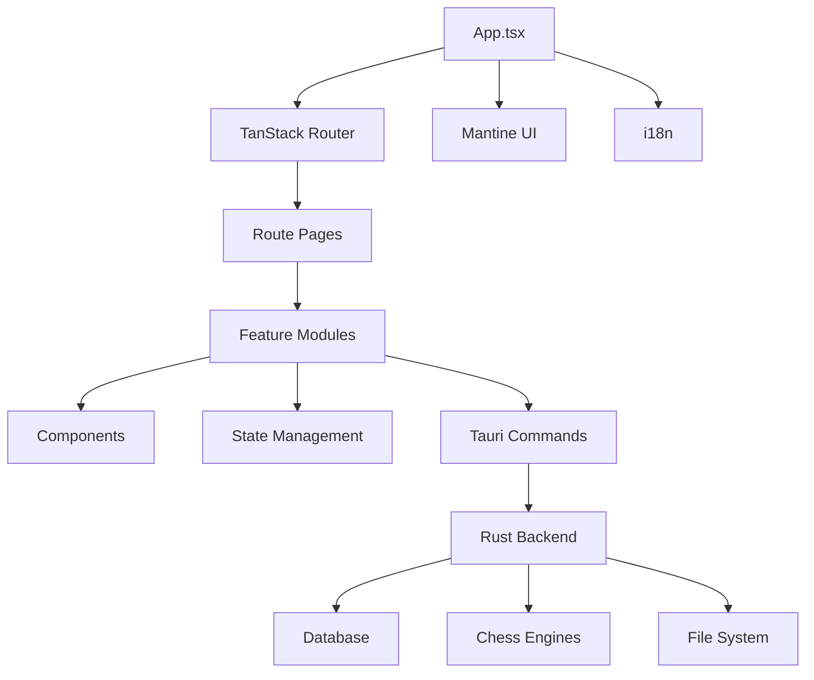

## Repository Layout

Obsidian Chess Studio follows a **monorepo** structure with frontend and backend code in separate directories:

```
Obsidian-Chess-Studio/
├── src/                    # Frontend (React + TypeScript)
├── src-tauri/             # Backend (Rust + Tauri)
├── package.json           # Frontend dependencies
├── vite.config.ts         # Vite configuration
├── tsconfig.json          # TypeScript configuration
├── biome.json             # Biome linter/formatter config
├── README.md              # Project documentation
├── CONTRIBUTING.md        # Contribution guidelines
├── CHANGELOG.md           # Version history
└── LICENSE                # GPL-3.0 license
```

## Frontend Structure (`src/`)

The frontend is built with **React 19**, **TypeScript**, and **Vite**.

### Directory Overview

```
src/
├── components/            # Reusable UI components
│   ├── Clock/             # Chess clock component
│   ├── GenericCard/       # Card wrapper component
│   ├── GenericHeader/     # Header component
│   ├── icons/             # Custom icon components
│   └── panels/            # Main panel components
├── features/              # Feature modules (domain-driven)
│   ├── boards/            # Chess board and game UI
│   ├── chessbase/         # ChessBase integration
│   ├── dashboard/         # Dashboard and statistics
│   ├── databases/         # Database management UI
│   ├── engines/           # Engine configuration UI
│   ├── events/            # Event/tournament management
│   ├── files/             # File import/export
│   ├── profiles/          # User profile management
│   ├── settings/          # Application settings
│   ├── themes/            # Theme customization
│   ├── tournaments/       # Tournament features
│   └── variants/          # Repertoire and variants
├── routes/                # TanStack Router pages
├── state/                 # State management
│   ├── atoms.ts           # Jotai atoms (global state)
│   ├── keybindings.ts     # Keyboard shortcut state
│   ├── store/             # Zustand stores
│   └── utils.ts           # State utilities
├── utils/                 # Helper functions
├── hooks/                 # Custom React hooks
├── locales/               # i18n translations (17+ languages)
├── services/              # External service integrations
├── styles/                # Global styles and themes
├── types/                 # TypeScript type definitions
├── bindings/              # Auto-generated Rust bindings
├── App.tsx                # Root component
├── index.tsx              # Application entry point
├── i18n.ts                # i18n configuration
└── routeTree.gen.ts       # Generated route tree
```

### Feature Module Pattern

Each feature follows a consistent structure:

```
features/[feature-name]/
├── components/            # Feature-specific components
├── hooks/                 # Feature-specific hooks
├── utils/                 # Feature-specific utilities
├── __tests__/             # Feature tests
└── index.ts               # Public exports
```

### Key Files

<AccordionGroup>
  <Accordion title="App.tsx" icon="react">
    Root application component that:
    - Initializes Mantine UI
    - Sets up TanStack Router
    - Configures theme and i18n
    - Handles app-level error boundaries
    
    **Location:** `src/App.tsx`
  </Accordion>
  
  <Accordion title="state/atoms.ts" icon="atom">
    Jotai atoms for global state management:
    - `enginesAtom` - Chess engine configurations
    - `tabsAtom` - Open board tabs
    - `databaseAtom` - Active database state
    - `settingsAtom` - Application settings
    
    **Location:** `src/state/atoms.ts`
  </Accordion>
  
  <Accordion title="i18n.ts" icon="language">
    i18next configuration:
    - Loads all translation files
    - Configures language detection
    - Registers custom formatters (dates, chess notation, etc.)
    
    **Location:** `src/i18n.ts`
  </Accordion>
  
  <Accordion title="bindings/" icon="code">
    Auto-generated TypeScript types from Rust:
    - Generated by `tauri-specta`
    - Provides type-safe Tauri command signatures
    - Automatically updated on build
    
    **Location:** `src/bindings/`
  </Accordion>
</AccordionGroup>

## Backend Structure (`src-tauri/`)

The backend is built with **Rust** and **Tauri 2**.

### Directory Overview

```
src-tauri/
├── src/
│   ├── app/                   # Platform abstraction layer
│   │   ├── platform/
│   │   │   ├── desktop/       # Desktop-specific code
│   │   │   │   ├── windows.rs
│   │   │   │   ├── macos.rs
│   │   │   │   └── linux.rs
│   │   │   └── mobile/        # Mobile-specific code
│   │   │       ├── android.rs
│   │   │       └── ios.rs
│   │   └── setup.rs           # App initialization
│   ├── chess/                 # Chess engine management
│   │   ├── analysis.rs        # Analysis logic
│   │   ├── commands.rs        # Tauri commands
│   │   ├── engine_path.rs     # Engine path resolution
│   │   ├── evaluation.rs      # Position evaluation
│   │   ├── manager.rs         # Engine lifecycle management
│   │   ├── process.rs         # Engine process handling
│   │   ├── types.rs           # Engine types
│   │   └── uci.rs             # UCI protocol implementation
│   ├── db/                    # Database layer
│   │   ├── analysis_stats.rs  # Game analysis statistics
│   │   ├── bulk_insert.rs     # Bulk game insertion
│   │   ├── core.rs            # Database connection management
│   │   ├── encoding.rs        # Move encoding/decoding
│   │   ├── models.rs          # Diesel models
│   │   ├── online_sync.rs     # Online account sync
│   │   ├── ops.rs             # Database operations
│   │   ├── pgn.rs             # PGN import/export
│   │   ├── player_stats.rs    # Player statistics
│   │   ├── player_style.rs    # Playing style analysis
│   │   ├── position_cache.rs  # Position search cache
│   │   ├── schema.rs          # Diesel schema
│   │   ├── search.rs          # Position search
│   │   └── sync_state.rs      # Sync state tracking
│   ├── analysis_storage.rs    # Analysis result storage
│   ├── chessbase.rs           # ChessBase file handling
│   ├── chessbase_service.rs   # ChessBase service
│   ├── dashboard_games_history.rs  # Game history queries
│   ├── error.rs               # Error types
│   ├── fide.rs                # FIDE API integration
│   ├── fs.rs                  # File system operations
│   ├── lexer.rs               # PGN lexer
│   ├── lib.rs                 # Library entry point
│   ├── main.rs                # Binary entry point
│   ├── oauth.rs               # OAuth2 implementation
│   ├── online.rs              # Online platform integration
│   ├── opening.rs             # Opening classification
│   ├── package_manager.rs     # Package/database downloads
│   ├── pawn_structures.rs     # Pawn structure analysis
│   ├── pgn.rs                 # PGN parsing
│   ├── player_match_planner.rs # Match planning
│   ├── puzzle.rs              # Puzzle system
│   ├── puzzle_variants.rs     # Puzzle variant handling
│   ├── variant_positions.rs   # Variant position storage
│   └── variants_builder.rs    # Repertoire building
├── Cargo.toml                 # Rust dependencies
├── tauri.conf.json            # Tauri configuration
├── capabilities/              # Tauri security capabilities
└── icons/                     # App icons
```

### Key Modules

<Tabs>
  <Tab title="Database (db/)">
    **Core database functionality** using Diesel ORM and SQLite.
    
    **Key files:**
    - `core.rs` - Connection pooling, initialization
    - `schema.rs` - Database schema (Diesel-generated)
    - `models.rs` - Rust structs for database tables
    - `ops.rs` - CRUD operations
    - `search.rs` - Position search algorithms
    - `player_stats.rs` - Statistical queries
    
    **Tables:**
    - `Games` - Chess games with moves
    - `Players` - Player information
    - `Events` - Tournament/event data
    - `Sites` - Game locations
    - `Puzzles` - Tactical puzzles
    - `Comments` - Game annotations
    
    See [Database Architecture](/development/architecture/database) for details.
  </Tab>
  
  <Tab title="Chess Engines (chess/)">
    **UCI engine management** with multi-engine support.
    
    **Key files:**
    - `manager.rs` - Engine lifecycle (start/stop/configure)
    - `process.rs` - Process spawning and communication
    - `uci.rs` - UCI protocol parser
    - `analysis.rs` - Analysis coordination
    - `evaluation.rs` - Evaluation parsing
    
    **Features:**
    - Simultaneous multi-engine analysis
    - Configurable depth and time controls
    - Tablebase integration
    - Engine reordering and priority
    
    See [Backend Architecture](/development/architecture/backend) for details.
  </Tab>
  
  <Tab title="PGN Processing">
    **High-performance PGN parsing** using `pgn-reader` and `shakmaty`.
    
    **Key files:**
    - `pgn.rs` - PGN parsing and writing
    - `lexer.rs` - Custom PGN tokenizer
    - `db/pgn.rs` - Database import/export
    - `db/encoding.rs` - Move compression
    
    **Optimizations:**
    - Parallel processing with Rayon
    - Move encoding (8 bytes per move)
    - Batch inserts (1000+ games/second)
    - Incremental parsing for large files
  </Tab>
  
  <Tab title="Platform Abstraction (app/)">
    **Cross-platform compatibility layer.**
    
    **Structure:**
    - `platform/desktop/` - Windows, macOS, Linux specifics
    - `platform/mobile/` - Android, iOS specifics
    - `platform/shared.rs` - Common platform code
    - `setup.rs` - App initialization
    
    **Platform-specific features:**
    - File system paths (AppData, Library, etc.)
    - Native dialogs
    - System integration (taskbar, notifications)
  </Tab>
</Tabs>

## Configuration Files

### Frontend Configuration

<CodeGroup>
```json package.json
{
  "name": "obsidian-chess-studio",
  "version": "2.6.9",
  "type": "module",
  "packageManager": "pnpm@10.27.0",
  "scripts": {
    "dev": "node scripts/tauri.mjs dev",
    "build": "tauri build --no-bundle",
    "test": "vitest run",
    "format": "biome format --write ./src",
    "lint:fix": "npx @biomejs/biome check --write src"
  }
}
```

```typescript tsconfig.json
{
  "compilerOptions": {
    "target": "es2015",
    "lib": ["dom", "dom.iterable", "esnext"],
    "moduleResolution": "bundler",
    "strict": true,
    "baseUrl": ".",
    "paths": {
      "@/*": ["src/*"]  // Import alias
    }
  }
}
```

```typescript vite.config.ts
export default defineConfig({
  plugins: [tanstackRouter(), react(), vanillaExtractPlugin()],
  server: {
    port: 1420,
    strictPort: true,
    host: "127.0.0.1"
  },
  resolve: {
    alias: [{ find: "@", replacement: resolve(__dirname, "./src") }]
  }
});
```
</CodeGroup>

### Backend Configuration

<CodeGroup>
```toml Cargo.toml
[package]
name = "obsidian-chess-studio"
version = "2.6.9"
edition = "2021"
license = "GPL-3.0-only"

[dependencies]
tauri = { version = "2.9.5", features = ["protocol-asset", "test"] }
diesel = { version = "2.3.5", features = ["sqlite", "r2d2"] }
shakmaty = "0.27.3"
pgn-reader = "0.26.0"
tokio = { version = "1.49", features = ["full"] }
rayon = "1.11.0"
# ... more dependencies

[profile.release]
opt-level = 3
lto = "thin"
codegen-units = 1
strip = true
```

```json tauri.conf.json
{
  "productName": "Obsidian Chess Studio",
  "version": "2.6.9",
  "identifier": "com.obsidianchessstudio.app",
  "build": {
    "devUrl": "http://127.0.0.1:1420",
    "frontendDist": "../dist"
  }
}
```
</CodeGroup>

## Module Organization

### Import Aliases

The project uses `@/` alias for clean imports:

```typescript
// Instead of:
import { Engine } from '../../../utils/engines';

// Use:
import { Engine } from '@/utils/engines';
```

### Dependency Graph



## Build Artifacts

### Development Build

```
src-tauri/target/debug/
├── obsidian-chess-studio      # Debug binary
├── deps/                       # Compiled dependencies
└── build/                      # Build scripts output
```

### Production Build

```
src-tauri/target/release/
├── obsidian-chess-studio      # Optimized binary
└── bundle/                     # Platform installers
    ├── dmg/                    # macOS disk images
    ├── msi/                    # Windows installers
    ├── deb/                    # Debian packages
    ├── rpm/                    # RPM packages
    └── appimage/               # AppImage bundles
```

## Next Steps

<CardGroup cols={2}>
  <Card title="Frontend Architecture" href="/development/architecture/frontend" icon="react">
    Deep dive into React architecture
  </Card>
  
  <Card title="Backend Architecture" href="/development/architecture/backend" icon="rust">
    Explore Rust backend design
  </Card>
  
  <Card title="Database Schema" href="/development/architecture/database" icon="database">
    Learn about the database layer
  </Card>
  
  <Card title="Contributing" href="/development/contributing" icon="code-pull-request">
    Start contributing code
  </Card>
</CardGroup>